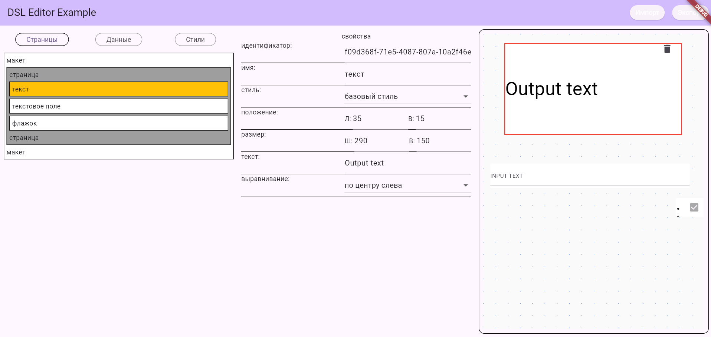

# Frame Forge

[](https://github.com/itjn-ru/layout_editor/blob/frame_forge/README.en.md)
[](https://github.com/itjn-ru/layout_editor/blob/frame_forge/README.md)

## Description

A Flutter package for creating dynamic UI layouts with a visual editor.

## Motivation

Change UI and data exchange with the client application server without code changes or app store updates.


## Installation

Add dependency to your `pubspec.yaml`:

```yaml
dependencies:
  frame_forge:
    git:
      url: https://github.com/itjn-ru/layout_editor
      ref: frame_forge
```

## Usage

### Create DSL Model
- Add required screen sizes for LayoutModel.
- Create controller

```dart
  final LayoutModel layoutModel = LayoutModel(
    screenSizes: [ScreenSizeEnum.mobile, ScreenSizeEnum.desktop],
  );
  
  late final LayoutModelController _layoutModelController =
      LayoutModelController(
        layoutModel: layoutModel,
        projectSaver: (map) async {
          // Configure project saving here
          return true;
        },
        projectLoader: (isSaved) async {
          /// Load model from file
          final FilePickerResult? result = await FilePicker.platform.pickFiles();
          if (result == null) return null;
          final PlatformFile file = result.files.first;
          return utf8.decode(file.bytes! as List<int>);
        },
      );
```

### Main Components

Output layout components:
```dart
Column(
  children: [
    Items(layoutModel.root, layoutModel),
  ],
),
```

Output layout data sources/variables:
```dart
Column(
  children: [
    Items(
        layoutModel.root.items
            .whereType<SourcePage>()
            .first, layoutModel,
    ),
  ],
),
```

Output layout styles:
```dart
Column(
  children: [
    Items(
        layoutModel.root.items
            .whereType<StylePage>()
            .first, layoutModel, 
    ),
  ],
),
```

Output layout processes:
```dart
Column(
  children: [
    ProcessItems(
        layoutModel.root.items
            .whereType<ProcessPage>()
            .first,layoutModel,
    ),
  ],
),
```

Output preview - how the page looks
Make sure to specify screen size from [enum ScreenSizeEnum]
```dart
LayoutBuilder(
    builder: (context, constraints) {
        return Consumer<LayoutModel>(
            builder: (context, value, child) {
                return ComponentsAndSources(value,constraints, screenSize);
            },
        );
    }
),
```
