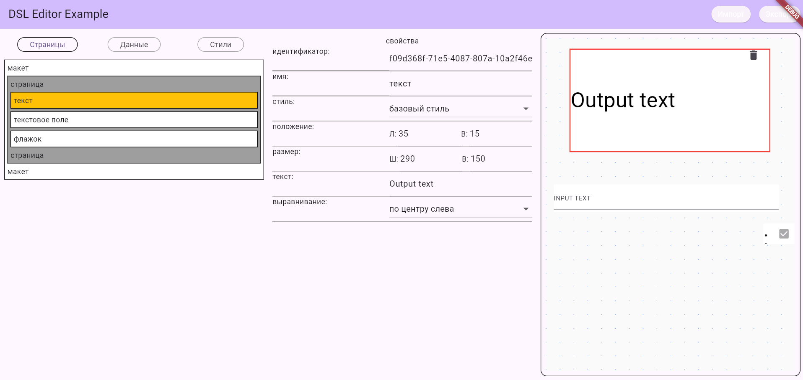

# Frame Forge

[](https://github.com/itjn-ru/layout_editor/blob/frame_forge/README.md)
[](https://github.com/itjn-ru/layout_editor/blob/frame_forge/README.ru.md)

## Описание
Для создания xml редактора UI элементов. 
 
## Motivation
Без изменения кода, загрузки в store изменять UI и обмен данными с сервером приложения клиента.   


## Установка

Добавьте зависимость в ваш `pubspec.yaml`:

```yaml
dependencies:
  frame_forge: ^1.0.0
```

## Использование

### Создать DSL модель
- Добавить нужные размеры экранов для LayoutModel.
- Создать контроллер

```dart
  final LayoutModel layoutModel = LayoutModel(
    screenSizes: [ScreenSizeEnum.mobile, ScreenSizeEnum.desktop],
  );
  
  late final LayoutModelController _layoutModelController =
      LayoutModelController(
        layoutModel: layoutModel,
        projectSaver: (map) async {
          // Здесь можно настроить сохранение проекта
          return true;
        },
        projectLoader: (isSaved) async {
          /// Загрузка модели из файла
          final FilePickerResult? result = await FilePicker.platform.pickFiles();
          if (result == null) return null;
          final PlatformFile file = result.files.first;
          return utf8.decode(file.bytes! as List<int>);
        },
      );
```

### Основные компоненты

Вывод компонентов макета:
```dart
Column(
  children: [
    Items(layoutModel.root, layoutModel),
  ],
),
```

Вывод источников-переменных макета:
```dart
Column(
  children: [
    Items(
        layoutModel.root.items
            .whereType<SourcePage>()
            .first, layoutModel,
    ),
  ],
),
```

Вывод стилей макета:
```dart
Column(
  children: [
    Items(
        layoutModel.root.items
            .whereType<StylePage>()
            .first, layoutModel, 
    ),
  ],
),
```

Вывод процессов макета:
```dart
Column(
  children: [
    ProcessItems(
        layoutModel.root.items
            .whereType<ProcessPage>()
            .first,layoutModel,
    ),
  ],
),
```

Вывод вьюшки, как страница выглядит
Обязательно указать размер экрана из [enum ScreenSizeEnum]
```dart
LayoutBuilder(
    builder: (context, constraints) {
        return Consumer<LayoutModel>(
            builder: (context, value, child) {
                return ComponentsAndSources(value,constraints, screenSize);
            },
        );
    }
),
```
